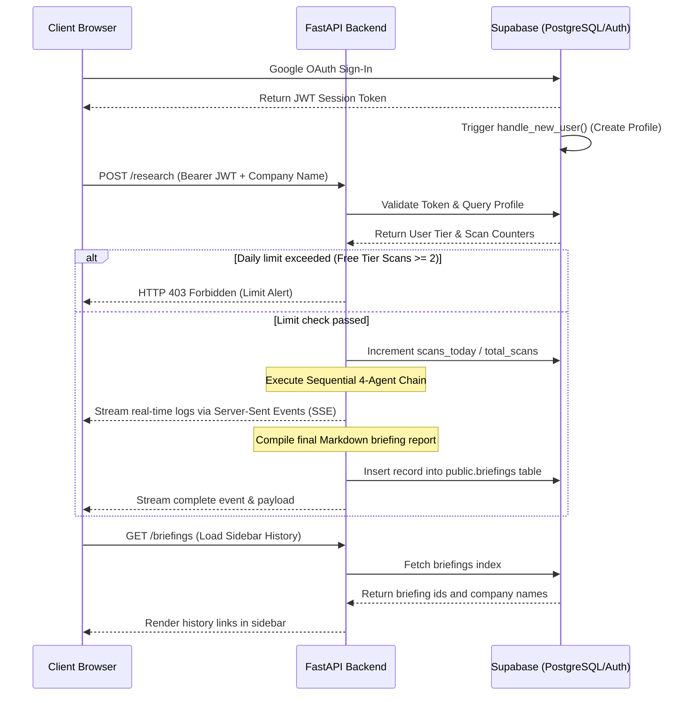
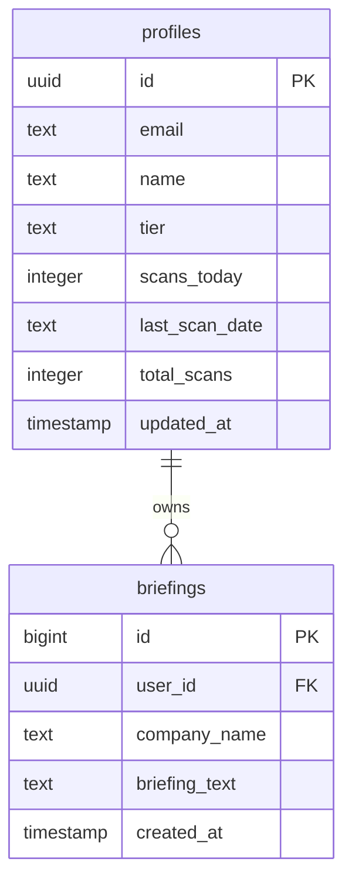

# Briefd — Competitive Research Multi-Agent Tool

Briefd is a premium platform designed to automate competitive intelligence reporting. By orchestrating a sequential pipeline of four autonomous AI agents, it conducts deep, multi-dimensional analyses of target companies in real-time.


---

## Product Flow

The following describes the end-to-end operation of Briefd:



---

## AI & Machine Learning Architecture

Briefd is built as a sequential multi-agent system that leverages advanced Natural Language Processing (NLP), Zero-Shot Reasoning, and dynamic Retrieval-Augmented Generation (RAG).

### 1. Generative LLM Core
The system utilizes Google Gemini 1.5 Flash as its primary large language model (LLM) reasoning engine. The model is called via the official `google-genai` SDK to perform:
* **Few-Shot and Zero-Shot Semantic Extraction**: Inferring core business models, key competitors, and market positions from unstructured search results.
* **Context-Driven Synthesis**: Analyzing text inputs to distill key strategic risks and positioning trends.

### 2. Multi-Agent Sequential Chain-of-Thought (CoT)
The orchestrator chains four specialized agents in a sequence, passing the output context of preceding agents forward. This mimics a multi-step reasoning protocol.

Mathematically, let $Q$ represent the user's initial target company query. Let $A_1, A_2, A_3, A_4$ represent the four autonomous agents.

1. **Company Researcher ($A_1$)** generates a structured profile context $C_1$:
   \[C_1 = A_1(Q)\]

2. **Competitor Finder ($A_2$)** evaluates the query and the profile context $C_1$ to locate major rivals, producing context $C_2$:
   \[C_2 = A_2(Q, C_1)\]

3. **Market Positioning Analyst ($A_3$)** maps the competitive landscape using the aggregated context, producing context $C_3$:
   \[C_3 = A_3(Q, C_1, C_2)\]

4. **Briefing Writer ($A_4$)** performs a final synthesis of all accumulated contexts, compiling the final formatted intelligence briefing report $B_R$:
   \[B_R = A_4(Q, C_1, C_2, C_3)\]

This sequential propagation of context prevents context drift and guides the LLM to write highly relevant sections without losing precision over long pipelines.

### 3. Agentic Retrieval-Augmented Generation (RAG)
To prevent the common problem of LLM hallucinations, Agent 1 (Company Researcher) acts as a RAG retrieval agent:
* **Web Search Tool Integration**: The agent queries real-time web indexes via the Tavily Search API.
* **Semantic Filtering**: Unstructured HTML payloads and press releases are filtered and summarized by the agent to extract only relevant tokens.
* **Prompt Grounding**: The retrieved real-time information is injected into the LLM system prompt as verified facts. This ensures the output is grounded in real-time truth, resolving the knowledge cutoff limitation of pre-trained weights.

### 4. NLP Parsing and Markdown Structuring
Agent 4 (Briefing Writer) applies strict syntax formatting instructions to the output. By using role-prompting and structure templates, the agent maps the compiled information into standardized markdown categories, ensuring consistent JSON-to-text formatting.

---

## Agent Pipeline Flow

1. **Company Researcher**: Queries Tavily Search indexes to construct a company profile (founding date, headquarters, business models, funding, and recent news).
2. **Competitor Finder**: Evaluates the company profile to isolate key search phrases, scan for 3-5 major competitors or alternatives, and outline their offerings.
3. **Market Positioning Analyst**: Takes findings from the previous steps to map where the target company stands in terms of pricing, features, market sizing, and industry trends.
4. **Briefing Writer**: Synthesizes the aggregated data into five structured markdown sections: Snapshot, Competitors, Positioning, Key Insights, and Strategic Risks.

---

## Database Schema

Briefd utilizes Supabase PostgreSQL for authentication state and data persistence.



### Profiles Table (`public.profiles`)
Represents user metadata, billing tiers, and scan counters. Connected to Supabase Auth.

| Column | Type | Constraints | Description |
| :--- | :--- | :--- | :--- |
| `id` | uuid | Primary Key, References `auth.users` | Unique identifier matching authentication record |
| `email` | text | Not Null | User email address |
| `name` | text | - | User display name |
| `tier` | text | Default `'free'` | Subscription tier: `'free'` or `'pro'` |
| `scans_today` | integer | Default `0` | Daily scan counter |
| `last_scan_date`| text | Default `''` | Iso-format date of the last scan (`YYYY-MM-DD`) |
| `total_scans` | integer | Default `0` | Total scans generated historically |
| `updated_at` | timestamp | Default `now()` | Record modification timestamp |

### Briefings Table (`public.briefings`)
Stores persisted competitive intelligence briefs.

| Column | Type | Constraints | Description |
| :--- | :--- | :--- | :--- |
| `id` | bigint | Primary Key, Generated Identity | Unique briefing identifier |
| `user_id` | uuid | References `auth.users`, Not Null | Owner identifier |
| `company_name` | text | Not Null | Searched company name |
| `briefing_text` | text | Not Null | Persisted markdown report content |
| `created_at` | timestamp | Default `now()` | Generation timestamp |

---

## Environment Variables

### Backend Configuration (`backend/.env`)
Create a `.env` file inside the `backend` directory:
```env
GEMINI_API_KEY=your_gemini_api_key_here
TAVILY_API_KEY=your_tavily_api_key_here

# Supabase Configurations
SUPABASE_URL=https://your-project-ref.supabase.co
SUPABASE_ANON_KEY=your_supabase_anon_public_key
SUPABASE_SERVICE_ROLE_KEY=your_supabase_service_role_secret_key
```

### Frontend Configuration (`frontend/.env`)
Create a `.env` file inside the `frontend` directory:
```env
VITE_SUPABASE_URL=https://your-project-ref.supabase.co
VITE_SUPABASE_ANON_KEY=your_supabase_anon_public_key
```

---

## Setup Instructions

### 1. Database Migrations
Run the SQL script located in the project's implementation plan or update files in the Supabase console SQL Editor to initialize the database tables, triggers, and Row Level Security (RLS) policies.

### 2. Backend Initialization
1. Navigate to the `backend/` folder:
   ```bash
   cd backend
   ```
2. Create and activate a Python virtual environment:
   * **Windows**:
     ```powershell
     python -m venv venv
     .\venv\Scripts\Activate.ps1
     ```
   * **macOS/Linux**:
     ```bash
     python -m venv venv
     source venv/bin/activate
     ```
3. Install Python requirements:
   ```bash
   pip install -r requirements.txt
   ```
4. Start the FastAPI development server:
   ```bash
   python -m uvicorn main:app --port 8000 --reload
   ```

### 3. Frontend Initialization
1. Navigate to the `frontend/` folder:
   ```bash
   cd frontend
   ```
2. Install Node packages:
   ```bash
   npm install
   ```
3. Launch Vite development server:
   ```bash
   npm run dev
   ```

---

## Project Structure

Briefd is organized into two primary folders:

```
├── backend/
│   ├── agents/              # Sequential Gemini research agents
│   │   ├── briefing.py      # Agent 4: Briefing writer agent
│   │   ├── company.py       # Agent 1: Company researcher agent
│   │   ├── competitors.py   # Agent 2: Competitor finder agent
│   │   └── positioning.py   # Agent 3: Positioning analyst agent
│   ├── tools/               # Tavily search tool wrappers
│   ├── main.py              # FastAPI server & route handlers
│   └── orchestrator.py      # SSE stream research orchestrator
└── frontend/
    ├── public/              # Favicon & index.html assets
    └── src/
        ├── components/      # UI components (briefings, search)
        ├── context/         # AuthContext.jsx coordinating Supabase Auth
        ├── pages/           # Pages (Dashboard, Privacy, Terms, Login)
        └── supabaseClient.js# Supabase Client initialization wrapper
```

---

## Security & Row Level Security (RLS)

All tables inside the Supabase database are secured with Row Level Security (RLS) to ensure tenant isolation:

1. **Profiles Table**:
   * Users can only select or update their own profile record.
   * `auth.uid() = id` controls read and write access.
   * The backend FastAPI service role key has bypass permissions to modify billing tiers.
2. **Briefings Table**:
   * Users can only select or insert briefings that match their UUID.
   * `auth.uid() = user_id` controls read and write access.

---

## API Specifications

| Endpoint | Method | Auth Required | Description |
| :--- | :--- | :--- | :--- |
| `GET /` | GET | No | Base API health check |
| `GET /auth/me` | GET | Yes (Bearer) | Fetches the current user profile from public.profiles |
| `POST /auth/upgrade` | POST | Yes (Bearer) | Upgrades user tier to 'pro' in the database |
| `GET /briefings` | GET | Yes (Bearer) | Lists all briefings created by the logged-in user |
| `GET /briefings/{id}` | GET | Yes (Bearer) | Retrieves full briefing details for a specific ID |
| `POST /research` | POST | Yes (Bearer) | Checks credit limits, runs agents, and streams SSE report |


